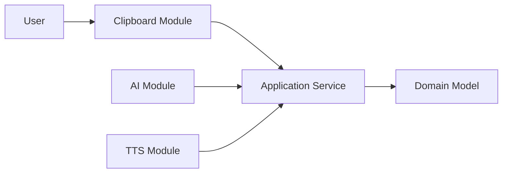

# ExplainMe

> [!NOTE]
> las anotaciones se encontrarán tanto en inglés como en Español ya que actualmente me encuetro practicando mi inglés, así que según la premura de mis aportaciones las iré haciendo en inglés o en español. En cuanto a  la información consultada por DeepSeek o ChatGpt por defecto están en Inglés que intentaré referenciar.

## ARCHITECTURE MODEL

