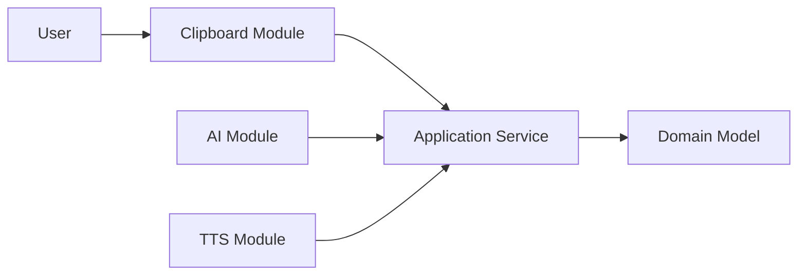
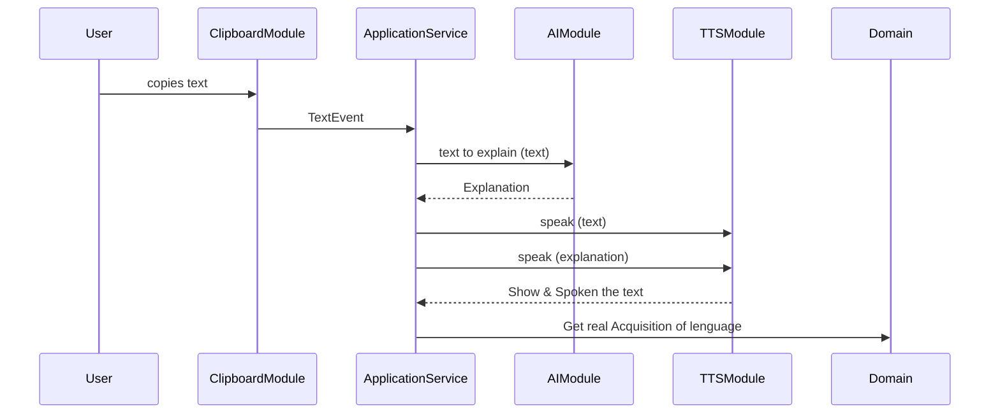

# ExplainMe
**ExplainMe** es una automatización sencilla para entornos Linux (sin Wayland) que te permite identificar cualquier texto que selecciones con el cursor y ejecutar un servicio basado en OpenAI para generar una explicación en inglés, usando un lenguaje coloquial y fácil de entender, sobre el significado del texto seleccionado.

Una regla importante de ExplainMe es que no se permiten traducciones ni referencias en español. Aunque al principio esto puede resultar frustrante, con el tiempo cada vez más palabras y expresiones se volverán familiares de forma natural.

No importa dónde se encuentre el texto: puede estar en una página web, un documento, la terminal o un chat. ExplainMe lo detectará y lo explicará.
#  
**ExplainMe** is a simple automation tool for Linux environments (non-Wayland) that allows you to identify any text you select with the cursor and run an OpenAI-based service to generate an explanation in English, using colloquial and easy-to-understand language, about the meaning of the selected text.

One important rule of ExplainMe is that translations or references in Spanish are not allowed. Although this may feel frustrating at first, over time more words and expressions will naturally become familiar.

It does not matter where the text is located—on a website, in a document, in the terminal, or in a chat. ExplainMe will detect it and explain it.
#

> [!NOTE]
> las anotaciones se encontrarán tanto en inglés como en Español ya que actualmente me encuetro practicando mi inglés, así que según la premura de mis aportaciones las iré haciendo en inglés o en español. En cuanto a  la información consultada por DeepSeek o ChatGpt por defecto están en Inglés que intentaré referenciar.
>
>

## BACKGROUD OF THEORY AND TECNIC

### Fundamentals of Second Language Acquisition &emsp;&emsp;&emsp;&emsp;*by Stephen Krashen and Jeff McQuillan*

I share the videos to know about the theory:
> Fundamentals of Second Language Acquisition: A Crash Course  
> &emsp;https://www.youtube.com/watch?v=d4RI0GWnWEs 
>
> Conversation About Language Acquisition  
> &emsp;https://www.youtube.com/watch?v=p7WUxvpPIKQ

To think about the theory and practice as separate things is a mistake. The authors of that theory suppose that there exist five principles, which are:

- **ACQUISITION**
- **NATURAL ORDER**
- **MONITOR**
- **INPUT**
- **AFECTIVE FILTER**

For the moment only say that those principles I can reasume in a Maxim:

>"Learning a new language requires immersing yourself in it. You need to actively use the words you're learning to grasp new concepts—it must be heard, not just read."

So, this was the GIDE LINE to use in this project, try to be more easy to the user interact whit the PC interface whe explore Enghlis text contain.

my personal experiences is that the most common user relate with the computer was the mouse ans the text selection. so i propose to implement that Evet that all operative sistem use, the text selection, but need to be carefuly because that practice maybe open insecurities, actually are a monioring of user inputs. 

## ARCHITECTURE MODEL

## SECUENCE MODEL

## ORDER OF DEVELOPMENT

## DEPENDENCIAS
aplay, paply y xclip

Instalación de xclip
`sudo apt install xclip`

## GEMAS
require 'colorize'

## REQUISITOS DEL SISTEMA
Todas las pruebas se han realizado en Debian 12, con entornos de escritorio XFCE y GNOME ambos con el gestor grafico X11

## INSTALLL

sudo apt install -y  python3  python3-full  python3-pip  pipx  wget  ca-certificates  ffmpeg

### Install model voices

sudo mkdir -p /opt/piper/models
sudo chmod -R 755 /opt/piper

> Para descargar más modelos, verifica que tengan una versión marcada como `hig` quality
> &empsp;https://huggingface.co/rhasspy/piper-voices/tree/main/en/en_US

sudo wget -O /opt/piper/models/en_US-ryan-high.onnx "https://huggingface.co/rhasspy/piper-voices/resolve/main/en/en_US/ryan/high/en_US-ryan-high.onnx?download=true"

sudo wget -O /opt/piper/models/en_US-ryan-high.onnx.json "https://huggingface.co/rhasspy/piper-voices/resolve/main/en/en_US/ryan/high/en_US-ryan-high.onnx.json?download=true"

sudo wget -O /opt/piper/models/en_US-lessac-high.onnx "https://huggingface.co/rhasspy/piper-voices/resolve/main/en/en_US/lessac/high/en_US-lessac-high.onnx?download=true"

sudo wget -O /opt/piper/modelsen_US-lessac-high.onnx.json "https://huggingface.co/rhasspy/piper-voices/resolve/main/en/en_US/lessac/high/en_US-lessac-high.onnx.json?download=true"

### Test of the installtion is done.
echo "This is my first trasformation of text to speach"| piper --model /opt/piper/models/en_US-ryan-high.onnx --output-raw  2>/dev/null | tee >(aplay -r 22050 -f S16_LE -t raw  >/dev/null 2>&1) | sox -r 22050 -e signed -b 16 -c 1 -t raw - speach2.wav >/dev/null 2>&1
