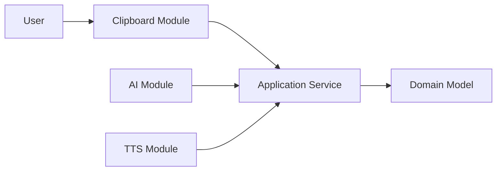
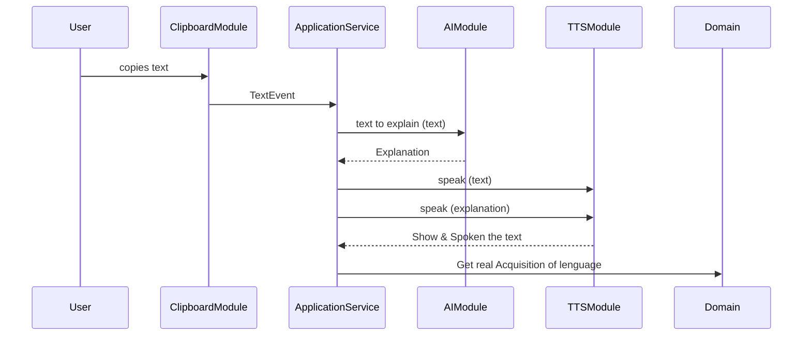

# ExplainMe

> [!NOTE]
> las anotaciones se encontrarán tanto en inglés como en Español ya que actualmente me encuetro practicando mi inglés, así que según la premura de mis aportaciones las iré haciendo en inglés o en español. En cuanto a  la información consultada por DeepSeek o ChatGpt por defecto están en Inglés que intentaré referenciar.
>
>

## BACKGROUD OF TEHORY AND TECNIC

### Fundameltal of second lenguage acquisition 
    _by Stephen Krasen and Jeff McQuillan_

I share the videos about the theory
> https://www.youtube.com/watch?v=d4RI0GWnWEs

> https://www.youtube.com/watch?v=p7WUxvpPIKQ

Think about the teory and practice  are separete things is a mistake

The authors of the theory supose that exist five principles that actually are:

- ACQUISITION
- NATURAL ORDER
- MONITOR
- INPUT
- AFECTIVE FILTER

For the moment only say that those principles I can reasume in a maxim

"Learning a new language requires immersing yourself in it. You need to actively use the words you're learning to grasp new concepts—it must be heard, not just read."

So, this was the GIDE LINE to use in this project, try to be more easy to the user interact whit the app.

my personal experiens is that the mos common user relate whit the computer was the mouse ans the text selection. so i propose to implement that Evet that all operative sistem use, the text selection, but need to be carefuly because that practice maybe open insecurities, actually are a monioring of user imputs. 

## ARCHITECTURE MODEL

## SECUENCE MODEL

## ORDER OF DEVELOPMENT

