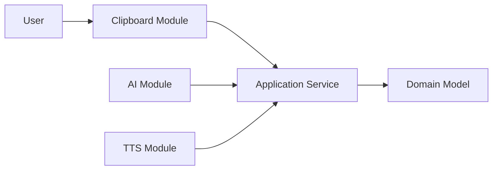

# ExplainMe

## ARCHITECTURE MODEL

```mermaid
flowchart LR
    User[User]
    
    Clipboard[Clipboard Module]
    AI[AI Module]
    TTS[TTS Module]
    
    App[Application Service]
    Domain[Domain Model]
    
    User --> Clipboard
    Clipboard --> App
    AI --> App
    TTS --> App
    App --> Domain


```

